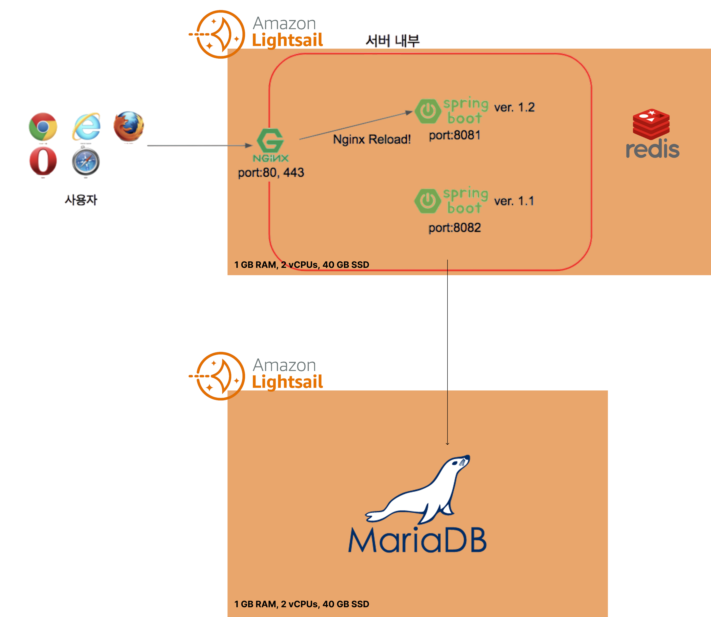
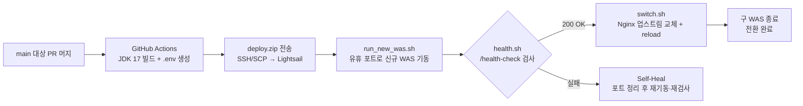

<p align="center">
  
</p>

<p align="center">
  수원대학교 동아리 지원 플랫폼 <b>동구라미</b>의 Spring Boot 백엔드 서버
</p>

<p align="center">
  
  
  
  
  
  
</p>

---

## 📢 서비스 상태

> **웹 서비스([donggurami.net](https://donggurami.net))가 현재 운영 중입니다.** iOS/Android 모바일 앱으로 출시된 이력이 있으며, 현재는 웹 중심으로 서비스되고 있습니다.

| 구분 | 링크 |
|---|---|
| 웹 서비스 (운영 중) | https://donggurami.net |
| API 서버 | https://api.donggurami.net |
| 프론트엔드(APP) 저장소 | https://github.com/2jang/USW-Circle-Link-APP |
| 앱 출시 이력 | [App Store](https://apps.apple.com/kr/app/id6692607046) · [Google Play](https://play.google.com/store/apps/details?id=com.usw.flag.temp.usw_circle_link) |

## 📌 프로젝트 소개

**동구라미**는 수원대학교 학생을 위한 동아리 지원 플랫폼입니다. 이 저장소는 학생의 동아리 탐색·지원, 동아리 회장의 부원·모집 관리, 동아리연합회(관리자)의 동아리·공지 관리를 **단일 Spring Boot 서버**로 제공하는 백엔드입니다.

- **개발 기간**: 2024.06 ~ 2025.10 · **상태**: 운영 중
- 하나의 서버가 `USER`(학생 앱/웹) / `LEADER`(회장 웹) / `ADMIN`(동아리연합회 웹) **3개 역할의 클라이언트**를 모두 담당합니다.

**특징적인 도메인 설계**

- 지원서 실체는 **구글폼에 위임**하고, 서버는 "지원 사실"만 기록합니다(`WAIT → PASS / FAIL`).
- 합격/불합격 결과는 **FCM 푸시**로 통보하고, 통보 4일 후 지원서를 스케줄러가 자동 삭제합니다.
- 엑셀로 등록된 부원은 **계정 없는 프로필(비회원)** 로 존재하다가, 가입 절차를 거쳐 계정과 연결된 정회원으로 승격됩니다.

## ✨ 주요 기능

| 역할 | 클라이언트 | 주요 기능 |
|---|---|---|
| 일반 사용자 (USER) | 모바일 앱 · 웹 | 회원가입(학교 메일 인증)·로그인·아이디/비밀번호 찾기·탈퇴, 동아리 탐색·상세 조회, 동아리 지원, 마이페이지(소속 동아리·지원 내역·프로필), FCM 합불 알림, 동밤 이벤트 인증 |
| 동아리 회장 (LEADER) | 웹 | 동아리 기본 정보·소개/모집글·사진(5슬롯) 관리, 모집 OPEN/CLOSE 토글, 지원자 일괄 합불 처리(FCM 푸시)·추가 합격, 부원 목록·일괄 퇴출 관리, 엑셀 명단 내보내기/가져오기 |
| 관리자 (ADMIN) | 웹 (동아리연합회) | 동아리 생성(회장 계정 동시 발급)·삭제, 카테고리 관리, 공지사항 작성·수정·삭제, 동아리방 층별 도면(B1/F1/F2) 관리 |
| 공통 | — | 통합 로그아웃·토큰 재발급(`/integration/**`), 비로그인 공개 조회(동아리 목록·상세, 공지, 층별 도면 등) |

## 📁 프로젝트 구조

도메인 우선 패키지 구조로, 각 도메인이 `api(Controller) → service → repository` + `domain`, `dto` 계층을 갖습니다.

```
src/main/java/com/USWCicrcleLink/server
├── ServerApplication.java   # 진입점 (@EnableScheduling)
├── admin/                   # 관리자(동아리연합회) — 동아리·카테고리·층별 사진·공지 관리
├── aplict/                  # 동아리 지원서 — 제출·합불 상태 관리
├── club/                    # 동아리 본체(club) + 소개·모집글(clubIntro) — 공개 조회 도메인
├── clubLeader/              # 동아리 회장 — 부원·모집·지원자 관리, 엑셀(POI), FCM 발송
├── email/                   # 이메일 인증 토큰·메일 발송 (Naver SMTP)
├── profile/                 # 사용자 프로필 — User와 1:1, 계정 없는 비회원 프로필 허용
├── user/                    # 일반 사용자 — 가입·인증·마이페이지·이벤트 인증
└── global/                  # 공통 — security(JWT)·exception·response·bucket4j·redis·s3File·validation·config·docs
```

## 🛠 기술 스택

| 분류 | 기술 |
|---|---|
| 언어 / 빌드 | Java 17, Gradle |
| 프레임워크 | Spring Boot 3.3.1 (Web, Validation, HATEOAS, AOP) |
| DB / ORM | MySQL 8.0.35, Spring Data JPA(Hibernate), p6spy(SQL 로깅) |
| 인메모리 저장소 | Redis 7.0.15 (Lettuce) — 리프레시 토큰 저장소 + 레이트리밋 버킷 전용(캐시 용도 아님) |
| 보안 | Spring Security, JJWT 0.11.5, BCrypt, Jsoup(XSS 새니타이즈) |
| 레이트리밋 | Bucket4j 8.7.0 + bucket4j-redis — AOP 기반 분산 버킷 |
| 스토리지 | AWS S3 — presigned URL 방식 업로드/조회(유효 1시간) |
| 알림 / 메일 | Firebase FCM(HTTP v1), Naver SMTP(JavaMailSender, 비동기 발송) |
| API 문서화 | springdoc-openapi 2.6.0 (Swagger UI) + ReDoc |
| 기타 | Apache POI(엑셀), Thymeleaf(메일 템플릿·인증 페이지) |
| 인프라 / 운영 | AWS Lightsail, Nginx(블루/그린), Docker Compose, GitHub Actions, Pinpoint 3.0.1(APM) |

## 🏗 아키텍처

<p align="center">
  
</p>

> ⚠️ 다이어그램의 **MariaDB** 표기는 **MySQL(8.0.35)** 의 오기입니다.

- **AWS Lightsail 2-인스턴스 구성**: 웹 인스턴스(Nginx + Spring Boot WAS 2개 `8081/8082` + Redis + Pinpoint Agent)와 DB 인스턴스(MySQL)를 분리 운영합니다.
- **블루/그린 무중단 배포**: Nginx가 참조하는 업스트림 설정(`service-url.inc`)을 교체하는 방식으로 활성 WAS를 전환합니다(상세 흐름은 아래 CI/CD 섹션 참조).
- **Redis의 두 가지 역할**: ① 리프레시 토큰 저장소(TTL 7일) ② Bucket4j 분산 레이트리밋 버킷 — 캐시 용도가 아닙니다.
- **이미지 처리**: 서버는 S3 presigned URL만 발급하고, 업로드/조회는 클라이언트가 S3와 직접 통신합니다.

**요청 처리 파이프라인**

```
클라이언트 → Nginx → CORS 필터 → JWT 필터 → 감사 로깅 필터 → 인가
          → Controller(AOP 레이트리밋) → Service(@Transactional) → JPA Repository → MySQL
```

**인증 체계**

| 항목 | 내용 |
|---|---|
| 액세스 토큰 | HS256 JWT, 유효 30분 |
| 리프레시 토큰 | JWT가 아닌 랜덤 UUID를 Redis에 저장(TTL 7일), HttpOnly 쿠키로 전달 |
| 회전 정책 | 재발급 시 RTR(Refresh Token Rotation), 계정당 1개(단일 세션) |
| 역할 판별 | 매 요청 시 UUID로 Admin/Leader/User 계정을 조회 — 권한 변경·탈퇴가 즉시 반영 |

**스케줄러 4종**: 만료 이메일 토큰 정리(매시 정각) / 통보 4일 경과 지원서 삭제·만료 FCM 토큰 정리·만료 임시회원 정리(매일 자정).

인프라 구성·요청 파이프라인·인증 체계의 상세는 [docs/SERVER_ARCHITECTURE.md](docs/SERVER_ARCHITECTURE.md)를 참고하세요.

## 📡 API 개요

| 항목 | 값 |
|---|---|
| 엔드포인트 | REST 총 **82개** |
| 공통 응답 래퍼 | `ApiResponse { message, data }` |
| 에러 코드 | `ExceptionType` 기반 약 103종 (`ErrorResponse`로 일관 응답) |
| 레이트리밋 | 로그인·메일 발송·코드 검증 등 어뷰징 취약 경로에 5회/5분 (Bucket4j + Redis) |
| API 문서 | Swagger UI `/` · ReDoc `/docs` |
| 헬스체크 | `GET /health-check` |

전체 엔드포인트의 요청/응답·에러 코드·레이트리밋 상세는 [docs/API_SPEC.md](docs/API_SPEC.md)에 정리되어 있습니다.

## 🗄 DB 스키마 개요

| 항목 | 값 |
|---|---|
| 테이블 수 | **22개** (JPA 엔티티와 1:1 대응) |
| 영역 구분 | 계정·인증 6 / 동아리 9 / 지원·공지·기타 7 |
| 식별자 설계 | 내부 `bigint` PK + 외부 API용 `binary(16)` UUID(13개 컬럼)의 **이중 식별자** |
| 인증 주체 | USER / LEADER / ADMIN — 물리적으로 분리된 3개 계정 테이블 |

- `uk_aplict_active`: 생성 컬럼으로 조건부 UNIQUE를 에뮬레이션해 "(동아리, 지원자)당 미처리 지원서 1건"을 DB 레벨에서 강제합니다.
- 전체 테이블 명세·ERD·제약조건은 [docs/DB_SCHEMA.md](docs/DB_SCHEMA.md)를 참고하세요.

## 🚀 시작하기

**요구사항**: JDK 17, Docker(Compose)

```bash
git clone https://github.com/2jang/USW-Circle-Link-Server.git
cd USW-Circle-Link-Server

# 1. 로컬 인프라 기동 — MySQL 8.0.35 + Redis 7.0.15
docker-compose up -d

# 2. 빌드
./gradlew build
```

> `docker-compose.yml`은 `TEST_MYSQL_*` 계열 환경변수를 참조하며, 값은 저장소 루트의 `.env` 파일로 주입합니다. 시크릿 값은 README·문서에 기재하지 않습니다.

**프로파일 구성** — `application.yml`이 `src/main/resources/yaml/` 하위 6개 파일을 임포트하며, 기본 활성 프로파일은 `local`입니다.

| 파일 | 용도 |
|---|---|
| `application-local.yml` | 로컬 개발 프로파일 (기본값) |
| `application-prod.yml` | 운영 프로파일 |
| `application-test.yml` | 테스트 프로파일 |
| `application-secret.yml` | 민감 설정 프로파일 — 파일에는 `${JWT_SECRET_KEY}` 같은 환경변수 플레이스홀더만 있으며(실값 없음), 실값은 `.env`/환경변수로 주입 |
| `application-file.yml` | 파일(업로드) 관련 설정 |
| `application-security.yml` | 보안 경로 설정(허용 경로·감사 로깅 대상) |

`local` / `prod` / `test` 각 그룹이 `secret` + `file` + `security`를 공통으로 로드합니다.

## ⚙️ CI/CD · 배포

`main` 브랜치 대상 PR이 머지되면 GitHub Actions가 AWS Lightsail에 **블루/그린 무중단 배포**를 수행합니다.



| 단계 | 스크립트 | 동작 |
|---|---|---|
| 신규 기동 | `scripts/run_new_was.sh` | 현재 활성 포트(8081/8082)의 반대 포트로 신규 WAS 기동 (prod 프로파일, Pinpoint agent 부착) |
| 헬스체크 | `scripts/health.sh` | 신규 WAS의 `/health-check`를 10초 간격 최대 10회 확인 |
| 전환 | `scripts/switch.sh` | Nginx `service-url.inc`를 신규 포트로 덮어쓰고 reload 후 구 WAS 종료 |

헬스체크가 끝내 실패하면 워크플로의 Self-Heal 단계가 양쪽 포트를 정리하고 재기동·재검사를 시도합니다.

## 🧪 테스트

```bash
./gradlew test
```

- 테스트 파일 12개 — `admin` · `aplict` · `clubIntro` · `profile` 도메인 위주로 작성되어 있습니다.
- `user` · `clubLeader` · `email` 도메인 테스트는 없어 **커버리지가 제한적**입니다.

## 📚 문서

| 문서 | 내용 |
|---|---|
| [docs/API_SPEC.md](docs/API_SPEC.md) | REST 엔드포인트 82개 전수 명세 — 요청/응답, 에러 코드, 레이트리밋 정책 |
| [docs/SERVER_ARCHITECTURE.md](docs/SERVER_ARCHITECTURE.md) | 인프라·배포 구조·요청 파이프라인·인증 체계 상세 |
| [docs/DB_SCHEMA.md](docs/DB_SCHEMA.md) | 22개 테이블 전수 명세 — ERD, 제약조건·인덱스, 설계 관찰 |

## 👥 기여자

커밋 이력 기준 주요 기여자입니다. (전체 목록: [Contributors](https://github.com/2jang/USW-Circle-Link-Server/graphs/contributors))

`hanjh` · `Hyeok` · `gioJioh` · `namgoong` · `2jang` · `Hyeonwoo Cho` · `HOYA`
